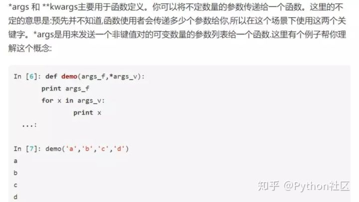

[toc]
---
# Road
---
# python语法

## 全局变量和局部变量

```python
a = "python"     # 函数外定义的a为全局变量
def func1():
	print (a)
	
def func2():
	b = "小黑屋"  # 函数内定义的b为局部变量
	print (b)

def func3():
    a = '小黑屋'
    print (a)
    # 无论你在函数内怎样改动这个函数的值，只有在函数内生效，对全局来说是没有任何影响的

func1()          # 执行函数func1
func2()          # 执行函数func2
func3()
print(b)         # 输出函数func2中的局部变量b

>>python         # 函数func1执行后输出全局变量a
>>小黑屋          # 函数func2执行后输出局部变量b
>>小黑屋          # 函数func3执行后输出局部变量a
# 在函数外输出局部变量b，出现了未定义错误


---------->>>>success<<<<-----------
a = "python"  # 函数外定义的a为全局变量
b = "cpp"
print (a, b)
def func1():
	global a, b
	a = "yu"
	b = "ty"
	print (a, b)
print (a, b)

>>python cpp
>>yu ty
>>yu ty
```


## 存储方式
1. python的数据存储方式
>在 Python 中 a = val 应该理解为给 val 贴上了一个标签 a。
>当再给 a 赋值时，就好象把 a 这个标签从原来的  val 上拿下来，指到其他对象上，建立新的 reference。
```python
>> a = [1, 2, 3]
>>> b = a             # b不是等于a, 而是 b 指向 a 指向的值
>>> a = [4, 5, 6]     # 对 a 重新赋值
>>> a
[4, 5, 6]
>>> b
[1, 2, 3]
# a 的值改变后，b 并没有随着 a 变

>>> a = [1, 2, 3]
>>> b = a
>>> a[0], a[1], a[2] = 4, 5, 6   # 改变原来 list 中的元素
>>> a
[4, 5, 6]
>>> b
[4, 5, 6]
# a 指向的列表没变, 列表中的值改变后，b 随着 a 变了
```

- 变量x，类似指针指向对象

- 对象object，类型已知，每个对象都包含一个头部信息（头部信息：类型标识符和引用计数器）
变量引用什么类型的对象，变量就是什么类型的。

```python
# id()是python的内置函数，用于返回对象的内存地址
In [39]: a=123
In [40]: b=a

In [41]: id(a)
Out[41]: 23242832

In [42]: id(b)
Out[42]: 23242832

In [43]: a=456

In [44]: id(a)
Out[44]: 33166408

In [45]: id(b)
Out[45]: 23242832

# is是用来判断两个引用所指的对象是否相同
# Python缓存了整数和短字符串，即使使用赋值语句，也只是创造新的引用，而不是对象本身
# Python没有缓存长字符串、列表及其他对象，可以有多个相同的对象，可以使用赋值语句创建出新的对象
# 整数
In [46]: a=1
In [47]: b=1
In [48]: print(a is b)
True

# 短字符串
In [49]: c="good"
In [50]: d="good"
In [51]: print(c is d)
True

# 长字符串
In [52]: e="very good"
In [53]: f="very good"
In [54]: print(e is f)
False

# 列表
In [55]: g=[]
In [56]: h=[]
In [57]: print(g is h)
False

# 引用计数
# 每个对象都有指向该对象的引用总数,查看对象的引用计数：sys.getrefcount()
# 当使用某个引用作为参数，传递给getrefcount()时，参数实际上创建了一个临时的引用。因此，getrefcount()所得到的结果，会比期望的多1
In [2]: import sys
In [3]: a=[1,2,3]
In [4]: getrefcount(a) # a 指的是对象[1, 2, 3]
Out[4]: 2

In [5]: b=a
In [6]: getrefcount(a)
Out[6]: 3
In [7]: getrefcount(b)
Out[7]: 3

# 容器对象中包含的并不是元素对象本身，是指向各个元素对象的引用
In [12]: a=[1,2,3,4,5]
In [13]: b=a
In [14]: a is b
Out[14]: True

In [15]: a[0]=6   
In [16]: a
Out[16]: [6, 2, 3, 4, 5]
In [17]: a is b
Out[17]: True

In [18]: b
Out[18]: [6, 2, 3, 4, 5]
```

- 引用计数
```python
# 引用计数增加
# 1. 对象被变量引用
In [39]: getrefcount(123)
Out[39]: 6

In [40]: n=123
In [41]: getrefcount(123)
Out[41]: 7

# 2. 变量被创建
In [42]: m = n
In [43]: getrefcount(123)
Out[43]: 8

# 3. 作为容器对象的一个元素
In [44]: a=[1,12,123]
In [45]: getrefcount(123)
Out[45]: 9

# 4. 被作为参数传递给函数：func(x)

# 引用计数减小
# 1. 对象的别名被销毁
In [46]: del m
In [47]: getrefcount(123)
Out[47]: 8

# 2. 对象的一个别名重新赋值
In [48]: n=456
In [49]: getrefcount(123)
Out[49]: 7

# 3. 对象在容器对象中被移除，或容器对象本身被销毁
In [50]: a.remove(123)
In [51]: a
Out[51]: [1, 12]

In [52]: getrefcount(123)
Out[52]: 6

# 4. 一个本地引用离开了它的作用域，如上面的func(x)函数结束时，x指向的对象引用减1
```

- 垃圾回收
>Python中的对象越来越多，占据越来越大的内存，启动垃圾回收(garbage collection)，将没用的对象清除
>当Python的某个对象的引用计数降为0时，说明没有任何引用指向该对象，该对象就成为要被回收的垃圾
>

当Python运行时，会记录其中分配对象(object allocation)和取消分配对象(object deallocation)的次数。当两者的差值高于某个阈值时，垃圾回收才会启动。

```python
In [74]: a=[321,123]
In [75]: del a
# del a后，已经没有任何引用指向之前建立的[321,123]，引用计数变为0，用户不可能通过任何方式接触或者动用这个对象，当垃圾回收启动时，Python扫描到这个引用计数为0的对象，就将它所占据的内存清空

In [93]: import gc
In [94]: gc.get_threshold()　　#gc模块中查看阈值的方法
Out[94]: (700, 10, 10)
# 700即是垃圾回收启动的阈值；
# 每10次0代垃圾回收，会配合1次1代的垃圾回收；而每10次1代的垃圾回收，才会有1次的2代垃圾回收；
# Python将所有的对象分为0，1，2三代；所有的新建对象都是0代对象；当某一代对象经历过垃圾回收，依然存活，就被归入下一代对象。

# 手动启动垃圾回收：　
In [95]: gc.collect()    #手动启动垃圾回收
Out[95]: 2
```

2. 内存池机制


3. `copy() and deepcopy()`
寻常意义的复制就是深复制，即将被复制对象完全再复制一遍作为独立的新个体单独存在。所以改变原有被复制对象不会对已经复制出来的新对象产生影响.

- 浅复制并不会产生一个独立的对象单独存在，他只是创建了一个指针指向了要复制的对象，所以当对指针操作改变数据块的时候，原始数据块就会发生变化.

- 似乎 deep copy 更加符合我们对「复制」的直觉定义: 一旦复制出来了，就应该是独立的了。如果我们想要的是一个字面意义的「copy」，那就直接用 deep_copy 即可
```python
import copy
>>> origin = [1, 2, [3, 4]]
#origin 里边有三个元素：1， 2，[3, 4]
>>> cop1 = copy.copy(origin)
>>> cop2 = copy.deepcopy(origin)
>>> cop1 == cop2
True
>>> cop1 is cop2
False 
#cop1 和 cop2 看上去相同，但已不再是同一个object

>>> origin[2][0] = "hey!" 
>>> origin
[1, 2, ['hey!', 4]]

>>> cop1
[1, 2, ['hey!', 4]]
>>> cop2
[1, 2, [3, 4]]
#把origin内的子list [3, 4] 改掉了一个元素，观察 cop1 和 cop2

copy.deepcopy(head) # 深拷贝复杂链表
```

4. 变量作用域
>L （Local） 局部作用域
E （Enclosing） 闭包函数外的函数中
G （Global） 全局作用域
B （Built-in） 内建作用域
以 L –> E –> G –>B 的规则查找，即：在局部找不到，便会去局部外找（例如闭包），再找不到就会去全局找，再者去内建中找

- Python除了`def/class/lambda` 外，其他如: `if/elif/else/ try/except for/while`并不能改变其作用域。定义在他们之内的变量，外部还是可以访问

- locals() 和 globals()
	- global 和 globals() 是不同的，global 是关键字用来声明一个局部变量为全局变量
	- globals() 和 locals() 提供了基于字典的访问全局和局部变量的方式

5. 递归中传参 list

   参数 list 传入的是地址，当后续 list 发生改变时，会影响上一阶段的结果


## 数据类型
最小值：Integer.MIN_VALUE= -2147483648 （-2的31次方）
最大值：Integer.MAX_VALUE= 2147483647  （2的31次方-1）

## 函数

##### 1. *args,  **kwargs



## 二进制转化
```python 
bin(5)  # int 转二进制 0b101

print("{:04b}".format(4)) # 0100

>>> x = 1234
>>> bin(x)
'0b10011010010'
>>> oct(x)
'0o2322'
>>> hex(x)
'0x4d2'

>>> int('1101',2)  
13
>>> int('0o226',8)   #00226 0：阿拉伯数字零   o：小写英文字母 o    226：八进制数
150
>>> int('0x96',16)
150

```

## 基本语法
```python
# 嵌套函数中声明全局变量
def func():
    x = 2
    def funck():
        nonlocal x
		print(x)
        
# 普通函数中声明全局变量        
x = 1        
def func():
    global x
    print(x)
    
# 一行写不下在行末尾加 \

left + (right - left) // 2 # 防溢出

True + True = 2
not None, not False, not True

9 // 2 = 4
9 / 2 = 4.5 
5 % 2   # 1
1e5 = 100000.0

and，or则依据是否非0来决定输出
and中含0，返回0； 均为非0时，返回后一个值
or中， 至少有一个非0时，返回第一个非0

# print的返回值 == None
# 对于所有没有return的函数，自动加上 return None
```
- format

- range
```python
range(5, -1, -1) # 5, 4, 3, 2, 1, 0
range(0, 6)      # 0, 1, 2, 3, 4, 5
range(0, 6, 2)   # 0, 2, 4
```

## list

- 定义
```python
l = []
l = [0 for _ in range(10)]
l = [[] for _ in range(10)]
[0] * 10
list(range(8))   # [0, 1, 2, 3, 4, 5, 6, 7]
length = len(l)  # 二维数组 col_length = len(l[0])
minx = min(l)
```

- 添加
```python
l.append(x)   # l.append([])
l.extend([a, b, c])  # 添加a, b, c加入l 
```

- 删除
```python
l.pop(0)      # 弹出0号位置 按索引删除 
l.remove('x') # 按值删除
del l[2:4] 	  # 删除指定范围
del l[2]

# 循环中删除指定元素
idx = 0 
for i in range(len(listx)):
    if listx[idx] == value:
        listx.pop(idx)
    else:
        idx += 1
```

- 查找
```python
'a' in l
l[0:3]   # 0,1,2 不包括位置3 / [::2] 步长2
l[::-1]  #倒序
l.index(values) # 返回在数组中的位置
```

- tips
```python
l.sort()              # 默认升序 修改原数组l
l.sort(reverse=True)  # 降序
l.sort(key=)          # key=len

new_list = sorted(l) # 生成新数组

[str(i) for i in l]  # list内元素 int 转 str

l.count(num) # 返回 num 在数组中的出现次数

list(reversed(range(10)))  # 倒序9-0
l.reverse()
```
## tuple

```python
tuple1=('两点水','twowter','liangdianshui',[123,456])
print(tuple1)
del tuple1

len(tuple)	计算元组元素个数
max(tuple)	返回元组中元素最大值
min(tuple)	返回元组中元素最小值
tuple(seq)	将列表转换为元组

name1 = ('一点水', '两点水', '三点水', '四点水', '五点水')

name2 = ('1点水', '2点水', '3点水', '4点水', '5点水')

list1 = [1, 2, 3, 4, 5]

# 计算元素个数
print(len(name1))
# 连接,两个元组相加
print(name1 + name2)
# 复制元组
print(name1 * 2)
# 元素是否存在 (name1 这个元组中是否含有一点水这个元素)
print('一点水' in name1)
# 元素的最大值
print(max(name2))
# 元素的最小值
print(min(name2))
# 将列表转换为元组
print(tuple(list1))
```


## string
- 定义
```python
s = "string"
'a' + 'b' + 'c'  # 'abc'
'abc' * 2        # 'abcabc'

```

- 拼接
```python
# str -> str
s = "00000003210Runoob01230000000"; 
s.strip( '0' )     # 去除首尾字符 0
" a b c  ".strip() # 去掉头尾空格"a b c"

# str -> list
"a/b/c".split("/")        # 以"/"分离 ['a', 'b', 'c']

# list -> str
"/".join(["a", "b", "c"]) # "a/b/c"
"".join(["a", "b", "c"])  # "abc" 
```

- 删除
```python

```

- 查找
```python
'i' in s
s.index('r') # 等价s.find('r') 无 则 -1 / 返回第一个'r'在s中的位置
```

- tips
```python
s.isalnum() # 全由字母或数字组成 True / s[6].isalnum() 单个字符判断
s.isdigit() # 是否是数字
s.isalpha() # 是否是字母 

s.upper()   # 转换为大写
s.lower()
s.title()   # 首字母大写

s.count('s') # 's'出现次数

s.replace('s', 'S') # 'String' 
s.replace('s', '')  # 'tring'
s.replace(' ', '%20') # 字符串中的空格用%20替换

s.split()     # 去除前后空格         ' abc  ' -> ['abc']
s.split('b')  # 以字符'b'隔开字符串   ' abc  ' -> ['a', 'c']

list('abcd')
['a', 'b', 'c', 'd']

ord('z')  # 122
chr(122)  # 'z'
```


## dict
- 定义
```python
d = {}


```

- 添加
```python
d[key] = value
d.update({'key1':values, 'key2':values})
d.update(key1=1, key2=2)
```

- 删除
```python
del d['key']
```

- 查找
```python
'key' in d  # 'key' not in d
d.keys()
d.values()
```

- tips
```python
for key in d: # i 表示 d.keys
for key in d.key():
for key, item in d.items():

# 字典排序    
sorted(d.items(), key=lambda x: x[1], reverse=True) # 翻转 降序
sorted(d.items(), key=lambda x: x[1], reverse=False)# 升序

sorted(dic) # 按key排序

```

## set
>去重
- 定义
```python
s = set()
s = set(('str', 'str1', 'str2')) 
s = {'str', 'str1', 'str2'}
s = set(list)
s = {(i, j)} # (i, j) 为一个单元
```

- 添加
```python
s.add((ix, jx)) # 添加一个单元(ix, jx)
```

- 删除
```python
s.discard(value) # 抛弃value, 如果元素不存在，不会发生错误
s.pop()
s.clear()
```

- 查找
```python
'word' not in s
```

- tips
```python
s1.union(s2) 			# 返回并集 s1 | s2
s2.intersection(s2) 	# 返回交集 s1 & s2
s1.issubset(s2) 		# s1是否是s2的子集

s1 = s1 - s2

s_ = sorted(s)
```
## 切换
```python
s = set([xxx])
l = list(s)

```

## queue
- 定义
```python
from queue import Queue
q = Queue()
```

- 添加
```python

```

- 删除

```python

```
- 查找
```python

```

- tips
```python

```


## 内置函数
```python
abs(x) # 绝对值
min(a, b), max(a, b) # 两个数字之间的比较
bin(a ^ b)     # 前缀'0b'开头 二进制 15 -> 0b1111
pow(x,n) 	   # x的n次方

int('-' + '231') # out: -231
int('1111', 2)   # out: 15 转换二进制 二进制str -> 十进制int 

# zip
```

## collections
```python
import collections

collections.Counter('dssf')
Counter({'d': 1, 's': 2, 'f': 1})

collections.Counter([2,2,1,1,1,2,2]) # Counter({2: 4, 1: 3}) 字典类型

------------------------
from collections import deque
q = deque()
q = deque([1,2,3], maxlen=2) # 由一个可迭代对象，一个最大规模组成
# 结果是deque([2, 3])，首先1进队，然后2进队，最后3进队，数据溢出，1消失

q = collections.deque([])
q.append('a')                   # 在最右边添加一个元素，此时 q=deque('a')
q.appendleft('b')               # 在最左边添加一个元素，此时 d=deque(['b', 'a'])
q.extend(['c','d'])     # 在最右边添加所有元素，此时 d=deque(['b', 'a', 'c', 'd'])
q.extendleft(['e','f']) # 在最左边添加所有元素，此时 d=deque(['f', 'e', 'b', 'a', 'c', 'd'])
q.pop()      # 将最右边的元素取出，返回 'd'，此时 d=deque(['f', 'e', 'b', 'a', 'c'])
q.popleft()  # 将最左边的元素取出，返回 'f'，此时 d=deque(['e', 'b', 'a', 'c'])
q.rotate(-2) # 向左旋转两个位置（正数则向右旋转），此时 d=deque(['a', 'c', 'e', 'b'])
q.count('a') # 队列中'a'的个数，返回 1
q.remove('c')   # 从队列中将'c'删除，此时 d=deque(['a', 'e', 'b'])
q.reverse()     # 将队列倒序，此时 d=deque(['b', 'e', 'a'])

```

## enumerate
```python
for index, value in enumerate(a_list):     # 枚举
    mapping[value] = index                 # mapping = {}
```

## zip
```python
l1=[3, 4, 5]
l2=[1, 6, 7]
zipped = zip(l1, l2)    # 压缩
print(*zipped)          # (3, 1) (4, 6) (5, 7)
print(list(zipped))

l1, l2 = zip(*zip(l1, l2))  # 解压
l1, l2 = zip(*zipped)
l1 = [3, 4, 5]
l2 = [1, 6, 7]
```

## 调试

## 输入输出
```python
a, b = input("请输入一个数字：")   # python输入 默认str类型 23 -> '2','3'
str = input() # 'a b cde'

strlist = input().split(' ')	 # ['a', 'b', 'cde']
str1, str2 = input().split(' ')  # 输入两个字符串，使用空格分隔输入

int_num = int(input()) # 输入一个数 转int
int_list = list(map(int, input().split(' '))) # 输入数字 空格作为分隔  

print('the x is : {}'.format(x))
print('{0}: {1}, {2}'.format(x, a, b))
print('{0:.2f} {1:s} are worth US${2:d}'.format(4.56, 'abc', 1))    # .2f 保留两位小数

print('i am yuty', num)
print(a, end = ' ')

print("%.2f"%(num))    # 保留两位小数
print((round(num, 2))) # 保留两位小数
```


## 进程与线程


# 数据结构

## 链表
```python
class ListNode:
    def __init__(self, x):
        self.val = x
        self.next = None
        
head = ListNode(-1)
head.next = next_node
```

1. 快慢指针找链表中间值
```python
def find_mid(head):
    slow, fast = head, head.next
    premid = slow
    while fast != None and fast.next != None:
        premid = slow # 中间值的前一个
        slow = slow.next
        fast = fast.next.next
    return premid
```


## 队列

dir(deque)查看deque的方法
```python

```

## 堆
利用heapq实现最小堆
```python
heapq # 最小堆
import heapq
heap = [1,2,3,4,5,8,9,6]

heapq.heapify(heap)           # 将列表转换为堆
x = heapq.heappop(heap)       # 弹出堆顶最小值并重建堆

heapq.heappush(heap, item)  # heap为定义堆，item增加的元素
x = heapq.heapreplace(heap, item) #  弹出最小元素值，替换新的元素值，重建堆

heapq.merge(heap1, heap2) # 合并两个堆
for i in heapq.merge(heap1, heap2):
    print(i, end=" ")
    
heapq.nlargest(n, heap)   # n个最大元素 
heapq.nsmallest(n, heap)  # n个最小元素
```


## 栈

## 树
### 二叉树
```python
class TreeNode:
    def __init__(self, x):
        self.val = x
        self.left = None
        self.right = None
        
root = TreeNode(val)
root.left = node_left
root.right = node_right

```


114. Flatten Binary Tree to Linked List


- 第一步: 就是左子树的right 指向右子树
- 第二步: 就是root的right指向左子树, 这里有个trick就是利用pre指针


平衡二叉树、B树、B+树、B*树 
https://zhuanlan.zhihu.com/p/27700617


### 遍历
1. 前序


2. 中序


3. 后序


### 求深度

### 求宽度

### 二叉搜索树 (Binary Search Tree)
>1. 左子树上所有节点的值均小于它的根节点的值
>2. 右子树上所有节点的值均大于它的根节点的值
>3. 任意节点的左、右子树也分别为二叉搜索树
>4. 没有键值相等的节点

109. Convert Sorted List to Binary Search Tree
把一个List转变成BST，那么也就相当于List的前半段变成BST，List后半段也变成BST，然后List的中位数作为BST的root就好了


- 二叉搜索树的中序遍历结果为递增序列


### 平衡二叉搜索树


## 图

### 拓扑排序 (Topological Sorting)
>拓扑排序通常用来“排序”具有依赖关系的任务。任意两个任务要么具有确定的先后关系，要么是没有关系
>有向无环图（DAG, Directed Acyclic Graph）
>拓扑排序是一个有向无环图的所有顶点的线性序列
>


1. 每个顶点出现且只出现一次。
2. 若存在一条从顶点 A 到顶点 B 的路径，那么在序列中顶点 A 出现在顶点 B 的前面。


- 写出拓扑排序
1. 从 DAG 图中选择一个 没有前驱（即入度为0）的顶点并输出。
2. 从图中删除该顶点和所有以它为起点的有向边。
3. 重复 1 和 2 直到当前的 DAG 图为空或当前图中不存在无前驱的顶点为止。
   当前图中不存在无前驱的顶点, 说明有向图中必然存在环。


## hash

1. hash

  装填因子a=元素个数/hash表长


# 排序

## 归并排序

「归并排序」是分治思想的典型应用，它包含这样三个步骤：
>分解:  待排序的区间分成左右两个子序列
>递归: 使用归并排序递归排序子序列 
>合并: 将排好序的子序列合并


```python
def mergeSort(nums, start, end):
    if start >= end: return
    mid = (start + end) // 2
    mergeSort(nums, start, mid)
    mergeSort(nums, mid + 1, end)
    merge(nums, start, mid,  end)

def merge(nums, start, mid, end):
    i, j, temp = start, mid + 1, []
    while i <= mid and j <= end:
	    if nums[i] <= nums[j]:
    		temp.append(nums[i])
    		i += 1
    	else:
            temp.append(nums[j])
    		j += 1
        while i <= mid:
            temp.append(nums[i])
            i += 1
        while j <= end:
            temp.append(nums[j])
            j += 1

        for i in range(len(temp)):
        	nums[start + i] = temp[i]
		temp.clear()
```

# 位运算

```python
a ^ b    # 异或操作 (相同的两个数字异或，值为0)
a & b    # 与操作 , 如果是偶数，n&1返回0；否则返回1，为奇数
a << 1   # 二进制左移一位 相当于乘2
a >> 1   # 二进制右移一位 相当于除以2,向下取整
(a + b) >> 1        # 除2向下取整
(a + b + 1) >> 1    # 除2向上取整
```


# 递归

>递归无非就是把问题拆解成具有相同解决思路的子问题，直到最后被拆解的子问题不能够拆分，这个过程是“递”。当解决了最小粒度可求解的子问题后，在“归”的过程中顺其自然的解决了最开始的问题。

记忆化递归
LeetCode120
```python
class Solution:
    def minimumTotal(self, triangle: List[List[int]]) -> int:
        n = len(triangle)
        # @lru_cache()
        def dfs(idx, j):
            if idx == n:
                return 0
            memo = min(dfs(idx + 1, j), dfs(idx + 1, j + 1)) + triangle[idx][j]           
            return memo
        return dfs(0, 0)

```


# 分治

### 背包问题

1. 01背包问题
2. 完全背包问题
3. 多重背包问题
4. 混合背包问题
5. 二维费用的背包问题
6. 分组背包问题
7. 背包问题求方案数
8. 求背包问题方案
9. 有依赖的背包问题


# 贪心
>假设一个问题比较复杂，暂时找不到全局最优解，那么我们可以考虑把原问题拆成几个小问题（分而治之思想），分别求每个小问题的最优解，再把这些“局部最优解”叠起来，就“当作”整个问题的最优解了。

第一步
明确到底什么是最优解
第二步
明确什么是子问题的最优解
第三步
分别求出子问题的最优解再堆叠出全局最优解

- 按串行任务分
时间串行的任务，按子任务来分解，即每一步都是在前一步的基础上再选择当前的最优解。

- 按规模递减分
规模较大的复杂问题，可以借助递归思想，分解成一个规模小一点点的问题，循环解决，当最后一步的求解完成后就得到了所谓的“全局最优解”。

- 按并行任务分
这种问题的任务不分先后，可能是并行的，可以分别求解后，再按一定的规则（比如某种配比公式）将其组合后得到最终解。


1. 01背包问题
有一个背包，最多能承载150斤的重量，现在有7个物品，重量分别为[35, 30, 60, 50, 40, 10, 25]，它们的价值分别为[10, 40, 30, 50, 35, 40, 30]
**0 - 1 要么选择 要么放弃**


# 动态规划


# 搜索算法

## 二分查找
>leetcode 704, 34, 33, 81
https://leetcode-cn.com/problems/search-insert-position/solution/te-bie-hao-yong-de-er-fen-cha-fa-fa-mo-ban-python-/

```python
        def base_search(self, nums, target) -> int:
            '''
                实现一个基础二分查找
                输入: 一个顺序list
                输出: 待查找的元素的位置
            '''
            left, right = 0, len(nums) - 1
            while left <= right:
                mid = left + (right - left) // 2  # (left + right) >> 1 除2 向下取整
                if nums[mid] == target:
                    return mid
                elif target < nums[mid]:
                    right = mid - 1
                elif target > nums[mid]:
                    left = mid + 1
            return -1
        
	
		def left_search(nums, target):
			'''
				存在多个相同数字
				左边界
			'''
            left, right = 0, len(nums) - 1
            while left <= right:
                mid = (left + right) // 2
                if nums[mid] == target:
                    right = mid - 1
                elif nums[mid] < target:
                    left = mid + 1
                elif nums[mid] > target:
                    right = mid - 1
            if left == len(nums) or nums[left] != target:
                return -1
            return left

        def right_search(nums, target):
        	'''
				右边界
			'''
            left, right = 0, len(nums) - 1
            while left <= right:
                mid = (left + right) // 2
                if nums[mid] == target:
                    left = mid + 1
                elif nums[mid] < target:
                    left = mid + 1
                elif nums[mid] > target:
                    right = mid - 1
            if right < 0 or nums[right] != target:
                return -1
            return right
            
```

因为我们初始化 right = nums.length - 1
所以决定了我们的「搜索区间」是 [left, right]
所以决定了 while (left <= right)
同时也决定了 left = mid+1 和 right = mid-1

因为我们只需找到一个 target 的索引即可
所以当 nums[mid] == target 时可以立即返回


## DFS
>


1. 拓扑排序 + DFS
```python
LeetCode 207
def canFinish(self, numCourses: int, prerequisites: List[List[int]])
        def dfs(i, adjacency, flags):
            if flags[i] == -1: return True
            if flags[i] == 1: return False
            flags[i] = 1
            for j in adjacency[i]:
                if not dfs(j, adjacency, flags): return False
            flags[i] = -1
            return True

        adjacency = [[] for _ in range(numCourses)]
        flags = [0 for _ in range(numCourses)]
        for cur, pre in prerequisites:
            adjacency[pre].append(cur)
        for i in range(numCourses):
            if not dfs(i, adjacency, flags): return False
        return True
```
2. 背包问题

```python


```

## BFS
1. 拓扑排序 + BFS
```python
LeetCode 207, 210
	def canFinish(self, numCourses: int, prerequisites: List[List[int]]):
        indegrees = [0 for _ in range(numCourses)]
        adjacency = [[] for _ in range(numCourses)]
        queue = deque()
        # 建立入度表, 邻接表
        for cur, pre in prerequisites:
            indegrees[cur] += 1
            adjacency[pre].append(cur)

        for i in range(len(indegrees)): # 入度为0的加入队列
            if not indegrees[i]: queue.append(i)
            
        # BFS
        while queue:
            pre = queue.popleft()
            numCourses -= 1
            for cur in adjacency[pre]:
                indegrees[cur] -= 1
                if not indegrees[cur]: queue.append(cur)
        return not numCourses

```

# 数学

### 质数

只能被1和它本身整除

```python

```


# 面试常考题

- 拓扑排序
- 二分法
- 哈希表
- 二叉查找树

- 动态规划
- 分治法
- 堆

- 贪心法
- 最小生成树
- 字典树
- 并查集


 

# Git
```shell
git add .
git commit -m 'the xxx commit'
git push
```


